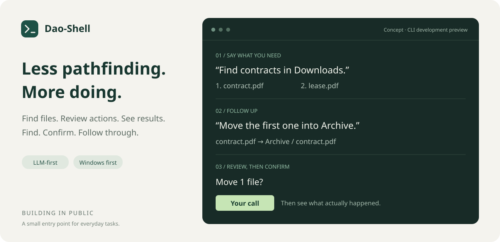

# Dao-Shell

[English](README.md) · [简体中文](README.zh-CN.md)

**A small, LLM-first shell for using your computer.**

Say what you want to do. Find a file, follow up on the results, review a proposed move, and decide whether to proceed. Dao-Shell helps with the task in front of you, then lets you get back to your work.

[Try the preview](docs/GETTING_STARTED.md) · [Roadmap](ROADMAP.md) · [Development log](docs/devlog/README.md) · [Share a use case](https://github.com/kestiny18/Dao-Shell/issues/new?template=use_case.yml)

_Interaction concept, not a running screenshot. The CLI and experimental desktop preview currently use a Chinese interface._

## Everyday tasks, in your own words

| What you want to do | What you might say |
| --- | --- |
| Find and open a file | “Find the recently modified PDFs in Downloads. Open the second one.” |
| Organize a few files | “Move these files into Contracts. Show me the plan first.” |
| Understand resource usage | “Check current resource pressure and explain possible causes.” |

These examples illustrate the intended experience. A Windows user has completed an initial real-model trial of search, follow-up references, and PDF opening with DeepSeek. Broader acceptance testing, including English prompts, is still ahead.

## A small entry point. You stay in control.

- **Natural language comes first.** Describe a task and continue from the results.
- **Review before changing things.** See the files and destinations, then confirm locally.
- **Results stay honest.** Completed, untouched, and uncertain outcomes are reported separately.
- **Search remains available without a model.** Direct commands provide a useful fallback.

Dao-Shell focuses on helping you use your computer. Coding-agent workflows, long-running goals, and autonomous background work are outside the current scope.

## Where things stand

This is a **Windows development preview**, with a CLI and an experimental desktop entry, not a stable end-user release.

- [x] File search, details, and requests to open files.
- [x] Guarded moves for small groups of files.
- [x] Resource sampling and natural-language interaction.
- [x] First-run guidance, hidden key input, optional Windows credential storage, and an in-place connection check.
- [x] Initial Windows trial with a real model.
- [ ] Full scenario acceptance, including file moves and resource explanations.
- [ ] Distribution testing on a clean Windows machine.

The [implementation record](docs/IMPLEMENTATION.md) (Chinese) separates implemented features from verified user experiences.

## Building in public

We share small steps, decisions, failed attempts, and unfinished work. A small desktop preview now lets you describe a file, choose a real candidate and confirm opening it. The next step is trying that flow with everyday files and real models. The roadmap follows what happens when people actually try the project.

The most useful feedback is a concrete situation: **What did you want to do, how do you do it today, and which step was frustrating?** Issues in English or Chinese are welcome.

[Share feedback](https://github.com/kestiny18/Dao-Shell/issues/new/choose) · [Roadmap](ROADMAP.md) · [Development log](docs/devlog/README.md) · [Contribute](CONTRIBUTING.md)

## Try it

The preview is for early users willing to share feedback. Start with Windows, a model service that supports tool calling, and a few disposable files. Direct search also works without a model.

Follow the [getting-started guide](docs/GETTING_STARTED.md) for setup and a first trial. The [documentation index](docs/README.en.md) lists further reading; implementation notes and development logs currently remain in Chinese.

Want to try the window? See the [desktop preview](desktop/README.md). It currently runs from source and reuses your CLI configuration; it is not an installer release.

**Project:** Dao-Shell · **Command:** `daosh` · **Prompt:** `dao >` · **Cargo package:** `dao-shell`

Maintained by [kestiny18](https://github.com/kestiny18). Copyright 2026 kestiny18. Licensed under [Apache License 2.0](LICENSE).
