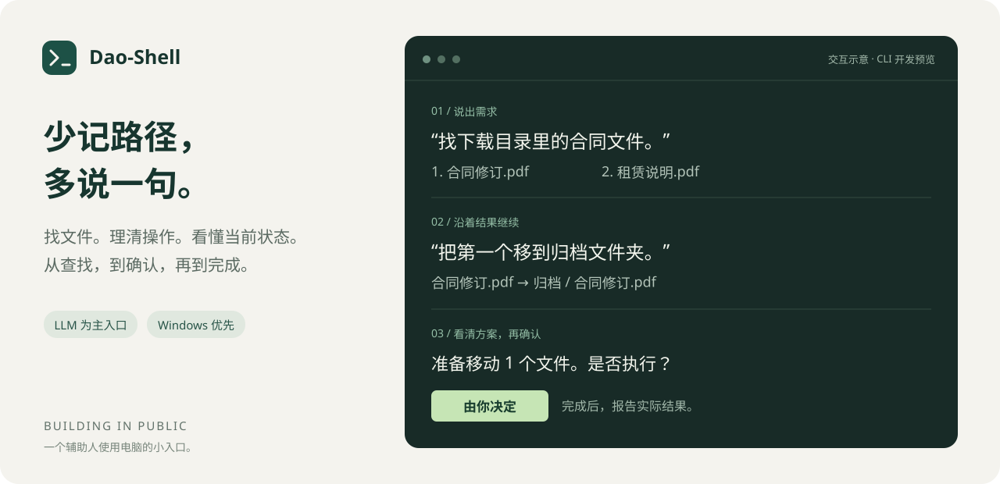

# Dao-Shell

[English](README.md) · [简体中文](README.zh-CN.md) · [文档导航](docs/README.md)

**用一句话，开始操作你的电脑。**

**项目：** Dao-Shell · **命令：** `daosh` · **输入提示：** `dao >` · **Cargo 包名：** `dao-shell`

Dao-Shell 是一个以 LLM 为主要入口的轻量智能 Shell。你说出想做的事，它帮你找到文件、看清操作方案，在你确认后完成整理，并告诉你实际发生了什么。

[开始体验](docs/GETTING_STARTED.zh-CN.md) · [文档导航](docs/README.md) · [正在做什么](ROADMAP.md) · [开发日志](docs/devlog/README.md) · [反馈一个使用场景](https://github.com/kestiny18/Dao-Shell/issues/new?template=use_case.yml)

*上图为交互示意，并非运行截图。当前产品是 Windows 命令行开发预览版，还没有桌面窗口。*

## 把日常电脑操作，说成一句话

| 你想做的事 | 可以这样说 | Dao-Shell 想帮你省下的步骤 |
| --- | --- | --- |
| 找到并使用文件 | “找下载目录里最近修改的 PDF，打开第二个。” | 少翻几个文件夹，沿着刚才的结果继续操作 |
| 整理几个文件 | “把这几个文件移到合同文件夹，先让我看看。” | 把来源、去向和需要新建的目录摆清楚，确认后再动 |
| 看看电脑为什么卡 | “查看当前资源压力，解释可能原因。” | 把当前 CPU、内存和进程信息放在一起看，说明观察与推测 |

这些是首版正在验证的使用场景。已有用户在 Windows 上完成真实模型查找和 PDF 打开；完整场景验收仍在推进，不会把示例当作已经完成的体验验收。

## 一个小入口，人始终在场

我们希望它足够轻：打开、说一句、完成眼前的操作，然后回到自己的事情。

- **自然语言是主入口。** 记得文件的大概名字、时间或类型，就可以从那里开始。
- **先看清，再改变。** 移动文件前展示具体方案，由你决定是否执行。
- **结果说实话。** 哪些完成了、哪些没动、哪些还无法确定，会分别告诉你。
- **没有模型也能找文件。** 保留一个很小的直接搜索入口，作为快捷方式和备用路径。

第一阶段聚焦“辅助人使用电脑”。完整 Agent 工作台、编程助手、长期目标和后台自主工作不在当前范围内。

## 现在走到哪里了

**阶段：Windows CLI 开发预览。** 已经有可运行代码，还不是面向所有人的稳定版本。

- [x] 文件查找、详情和打开请求。
- [x] 小批量移动：展示方案、确认、执行后核对。
- [x] 当前资源与进程观测。
- [x] 自然语言对话原型，可沿着刚才的文件结果继续操作。
- [x] 首次启动引导、隐藏密钥输入、可选 Windows 凭据保存和向导内连接验证。
- [x] 首轮真实模型查找、指代与打开，由 Windows 用户实测。
- [ ] 完整的日常场景与小批量移动验收。
- [ ] 干净 Windows 环境中的完整试用与分发验证。

执行流程已通过本地测试，真实模型目前只有首轮用户验证。具体证据和限制见 [实现记录](docs/IMPLEMENTATION.md)。

## 一起看它长出来

Dao-Shell 采用 **build in public** 的方式推进：公开小步进展、关键取舍、发现的问题，以及还没有解决的部分。路线图会随真实使用反馈调整，不提前承诺一个庞大的“万能助手”。

下一步优先把三件事做实：验证小批量整理、继续改善第一次使用、补齐 Windows 试用验证。更小的桌面入口留在后面探索。

如果你愿意参与，最有帮助的反馈是：**你当时想完成什么电脑操作？现在怎么做？哪一步最麻烦？**

[提交场景或问题](https://github.com/kestiny18/Dao-Shell/issues/new/choose) · [查看路线图](ROADMAP.md) · [阅读第一篇开发日志](docs/devlog/2026-09-16-first-preview.md) · [参与贡献](CONTRIBUTING.md)

## 想试一下

目前适合愿意反馈问题的早期使用者，需要 Windows 和一个支持工具调用的模型服务。也可以先体验不依赖模型的文件搜索。

[体验指南](docs/GETTING_STARTED.zh-CN.md) 包含获取、启动与模型配置；想运行源码，请看 [开发指南](docs/DEVELOPMENT.md)。

构建后的命令名是 `daosh`；Dao-Shell 是项目名称。

维护者：[kestiny18](https://github.com/kestiny18)。Copyright 2026 kestiny18。项目采用 [Apache License 2.0](LICENSE)。
