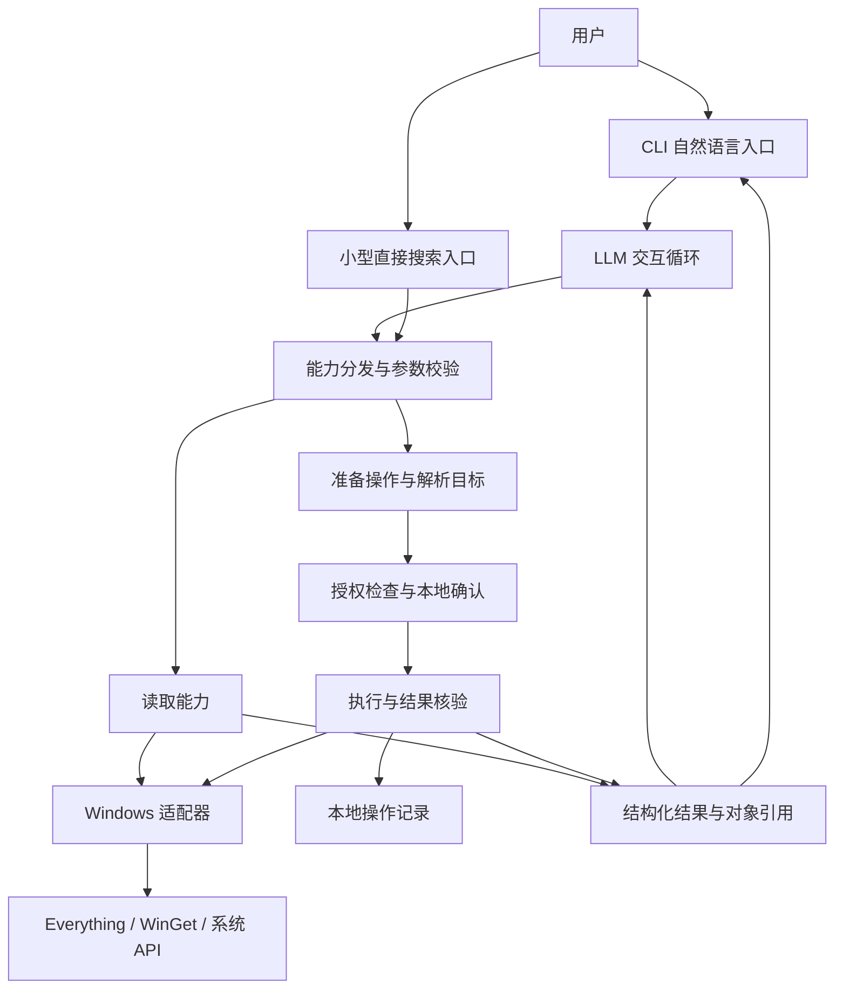
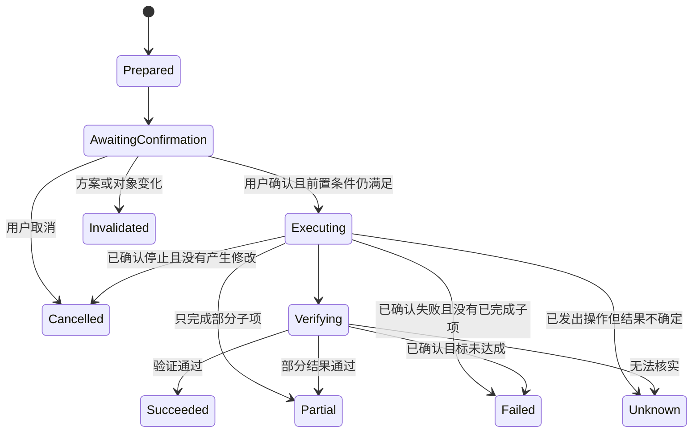

# Dao-Shell MVP 方案

日期：2026-09-16

状态：两轮讨论后的修订方案，双方目前无重大设计分歧；仍需实现验证。讨论过程见 [评审记录](reviews/2026-09-16-mvp-discussion.md)。

实现已启动；当前代码、验证结果与待验收项见 [实现记录](IMPLEMENTATION.md)。本文件保留设计目标，不将开发预览等同于完整验收。

## 1. 产品定位与已确定边界

**Dao-Shell 是以 LLM 为主要交互入口、辅助人使用和管理电脑的智能 Shell。**

主流程是：用户表达电脑操作需求，LLM 理解上下文并选择、组合能力，Shell 执行操作并反馈结果。模型可以追问、多步调用工具、根据返回结果调整下一步。

文件搜索另有一个很小的快捷入口，在用户只想搜索或模型不可用时直接使用。它是补充，不承担产品主线。

### 已由讨论确定

- LLM 是主要交互入口。
- 工作范围是文件、应用、进程、资源等电脑使用与管理操作。
- 不建设通用 Goal 管理、编程 Agent、研究写作工作流或另一套完整 Agent 平台。
- 可以有对话上下文、工具调用、多步操作、确认、进度和结果记录。
- Windows 优先，同时考虑 Linux、macOS 的接口边界。

### 本方案提出的实现选择

- Rust 实现，首个可使用版本为交互式 CLI，暂不做桌面窗口。
- v0.1 主闭环是文件查找、选择、打开与小范围整理，另提供资源压力观测与解释。
- 应用查找、安装与核验独立推进，不作为 v0.1 的完成门槛。
- 文件修改先支持同卷、小批量移动；资源能力先支持观测和解释。
- 单进程、前台工作，不启动常驻服务，不承诺退出后继续工作。
- 不为本项目引入 Noval 依赖；模型接入只覆盖当前 Shell 所需的交互循环。

这些选择用于控制首版范围，可在实际验证后调整。是否增加某项能力，首先看它是否直接帮助人操作电脑。

## 2. MVP 要验证的事情

用户能否通过一句自然语言，在较少切换工具和记忆命令的情况下，完成一项常见电脑操作，并清楚知道实际发生了什么。

首版必须完成 LLM 驱动的真实闭环。只有搜索命令、系统工具集合或聊天界面，均不算 MVP 完成。

| 场景 | 用户表达 | 首版完成标准 |
| --- | --- | --- |
| 找到并使用文件 | “找下载目录里上周修改的 PDF，打开第二个。” | 解析时间和范围，返回真实候选，保留指代关系，向系统提交打开请求 |
| 小范围整理文件 | “把这几个文件移到下载目录的合同文件夹，先让我看一下。” | 展示逐项来源与目的地，确认后移动，逐项核验并报告结果 |
| 解释资源压力 | “查看当前资源压力，解释可能原因。” | 采集一段时间内的系统及进程指标，区分观察、推测与建议，不自动结束程序 |

“找到合同”在首版主要依赖名称、路径、类型、大小和时间。无法从这些信息确定文件时展示候选或追问，不承诺理解任意 PDF/Office 内容。

用户仍然可以问“电脑怎么这么卡”，但产品承诺限定为资源压力观测与可能原因解释，不承诺定位完整根因。

应用方向的独立后续场景是：“看看 VLC 有没有安装，没有的话帮我安装。”该里程碑需要完整实现软件消歧、安装方案、执行及状态核验。它不影响 v0.1 的通过与发布。

## 3. 首版使用方式

### 3.1 LLM 主入口

计划命令：`dao-shell`。启动后直接进入自然语言交互，不要求创建 Goal、项目或任务。

```text
Dao-Shell
当前范围：下载、文档；模型：已连接

你：找下载目录里上周修改的 PDF。
Shell：正在查找……
       1. 合同修订.pdf   2.4 MB   09-10   下载\合同修订.pdf
       2. 租赁说明.pdf   860 KB   09-11   下载\租赁说明.pdf

你：把第一个放进合同文件夹。
Shell：准备移动 1 个文件：
       下载\合同修订.pdf → 下载\合同\合同修订.pdf
       将创建目录：下载\合同
       [执行] [取消]

用户选择执行后：
Shell：已移动 1 个文件，已核验目的地。
```

以上名称、大小和时间是交互示意，不是本机文件查询结果。

交互要求：

- 接受连续对话；“第一个”“刚才那个软件”绑定最近一次真实结果中的对象引用。
- 执行时显示简短进度，例如“查找中”“移动中”“核验中”。不展示模型内部推理。
- 候选项和操作确认由本地结构化数据渲染；LLM 负责说明，不负责伪造文件列表或完成状态。
- 本轮可以多次调用工具，但任一时刻只执行一个改变电脑状态的操作。
- `Ctrl+C` 请求停止本轮，保留已经发生的结果；明确区分“停止继续执行”和“撤回已执行操作”。
- 模糊或越界请求直接解释范围。遇到“帮我实现登录功能”，说明可以打开项目或开发工具，不开始编程。

### 3.2 小的搜索入口

计划命令：`dao-shell search 合同 --in <目录>`。此入口完全不请求模型，复用主入口的文件搜索、候选展示和打开功能。

模型调用失败时，主入口说明失败原因，并提供切换到直接搜索的选项；不把一次自然语言请求悄悄降级成关键词搜索。

### 3.3 最小设置与操作记录

- 设置：一个模型连接配置、可查询目录、Everything 路径及应用源信息。
- 一次性说明远程模型会接收用户输入和经过筛选的工具结果。首版不把文件正文读入模型上下文。
- 简短操作记录用于查看刚才改动了什么、是否成功，不形成待办看板或长期目标系统。
- 首版会话上下文只在当前进程中存在。重启可以查看操作记录，但不会自动继续上次未完成的指令。

## 4. 范围清单

| 领域 | v0.1 包含 | 后续再考虑 |
| --- | --- | --- |
| 文件 | 名称和元数据搜索、详情、打开文件/目录、创建目标目录并小批量移动 | 删除、覆盖、跨卷移动、备份、去重、全文与语义索引 |
| 应用 | 不作为必交付项；只有具备独立可靠路径的本地应用发现/启动才可作为附带功能 | 软件目录查询、安装与核验作为独立里程碑；之后再考虑卸载、升级、批量安装等 |
| 进程与资源 | CPU/内存/磁盘空间观测、进程列表、短时采样和解释 | 结束任意进程、挂起、资源限额、持续监控与自动调优 |
| 交互 | 自然语言、连续指代、候选选择、操作确认、进度、直接搜索 | 桌面 GUI、语音、全局唤起、浏览器及通用 GUI 操作 |
| 平台 | Windows 11 x64 的集成验证；核心保持可移植 | Linux/macOS 实际适配、ARM64 发布 |
| 智能执行 | 当前用户请求内的有限多步操作 | 通用 Goal、编程、定时任务、后台自主工作、多 Agent、插件市场 |

这里的“资源管理首版只读”是范围取舍。诊断结论不够充分时，允许报告“当前采样不足以解释卡顿”，不把最高内存进程直接判定为原因。

## 5. 总体架构



### 5.1 LLM 交互循环

负责解释用户需求、挑选能力、必要时追问，以及基于实际结果生成说明。第一版只接一个经过验证、支持工具调用的模型端点。

没有固定的 Planner/Executor/Reviewer 流程。基本循环是：模型返回文字或工具调用，系统验证并执行，结果返回模型，直至回答、等待用户选择或达到本轮限额。

默认每轮最多 12 次工具调用；读取调用有超时和结果条数限制。达到限额时说明进展并交还用户，不自动创建长期任务。后续应用里程碑中的安装由执行层跟踪进度，不通过模型反复轮询。

模型只拿到当前需要的能力、当前会话的有限上下文和裁剪后的工具结果。文件名称、应用描述及工具返回内容一律作为数据；其中出现的指令不产生授权。

本地代码限定实际发布的能力集合、平台与依赖可用性、读写范围、对象引用和已确认的操作。读写范围来自本地配置或用户明确的本次授权，不能由模型自行扩大。默认不向模型暴露尚未完成的应用能力。可按会话状态减少工具数量，但意图分类只用于路由优化，不能授予权限或替代具体动作确认；v0.1 不新建独立的自然语言权限分类器。

### 5.2 能力与执行层

负责类型校验、范围检查、精确目标解析、确认绑定、执行、取消和核验。模型不能自行设置“已批准”“无需确认”或“成功”。

查询直接返回事实。写入请求先形成不可变的操作方案；本地交互确认后，执行层调用适配器。确认内容变化时生成新方案，旧确认不沿用。

### 5.3 平台适配层

共同接口描述查询或操作的语义，并返回可用性、支持范围和结果证据。Windows 特有 API 和类型限定在 Windows 模块内。

平台信息不会被抹掉：软件来源、原生软件标识、搜索覆盖目录、采样时间、权限不足及不支持原因都应出现在结果中。

第一版先实现当前能力需要的窄接口，不预先构造庞大的 FileService/AppService 继承体系。Linux/macOS 只要求核心编译及纯逻辑测试通过，不伪造对应能力已可用。

## 6. 初始能力接口

以下名称是设计草案。读取和改变状态的请求走同一套校验与结果表示。v0.1 必交付的能力共 6 项：

| 能力 | 主要输入 | 主要输出 / 约束 |
| --- | --- | --- |
| `file.search` | 目录范围、名称关键词、扩展名、时间/大小过滤、排序、页码 | 对象引用、元数据、覆盖范围、是否截断、观察时间 |
| `file.inspect` | 文件/目录引用 | 当前路径、类型、大小、时间及可执行的操作 |
| `file.open` | 文件/目录引用、打开或定位模式 | 系统是否接受打开请求；不能据此宣称窗口或文档已经成功显示 |
| `file.move_batch` | 文件引用列表、目的目录 | 准备逐项移动方案；确认后执行；允许创建方案中明确列出的目的目录 |
| `resource.snapshot` | 有限采样窗口 | CPU、内存、磁盘空间等指标及采样区间 |
| `process.list` | 排序、过滤、结果上限 | 进程身份、可观察指标、无权读取的字段 |

独立应用里程碑拟增加 4 项能力。未实现、未验证的能力不登记到工具集合，不以空实现占位：

| 能力 | 主要输入 | 主要输出 / 约束 |
| --- | --- | --- |
| `app.search` | 名称关键词、已安装/目录/两者 | 来源明确的软件候选及本机安装匹配情况 |
| `app.inspect` | 软件引用 | 软件 ID、来源、版本、安装范围、已安装状态及可用启动入口 |
| `app.install` | 已解析的软件引用与安装选项 | 准备安装方案；确认后执行并查证安装状态 |
| `app.launch` | 已安装应用引用 | 调用已登记启动入口并报告系统返回的结果 |

执行限制：

- 文件搜索默认首屏 20 项，单次最多 50 项，可继续翻页。模型不能直接提交 Everything 查询表达式；适配器从类型化参数生成查询。
- 默认只搜索首次设置的目录。用户可以明确指定本次额外目录；系统不得根据模型猜测扩大到全盘。
- 文件整理首版最多 20 个普通文件，限同卷移动，不覆盖已有目标、不移动目录、不跟随重解析点。跨卷需求明确返回不支持。
- 路径、文件身份、源文件状态和目标冲突在准备阶段及执行前复核；实现时尽可能使用句柄约束目标，不能只有一次路径字符串检查。
- `file.open` 处理文档和目录；程序启动走 `app.launch`，不接受模型提供的任意命令行。
- 后续应用里程碑的首个安装实现使用已配置的 WinGet community 源，不接入付费商店、账号购买或任意下载链接。
- 多候选、安装来源或范围不明确时展示选择，不让 LLM 把猜测直接升级成安装对象。
- CPU 等速率指标需要至少两次采样；未知字段保留未知，不能填成零。

## 7. 最小数据模型与执行语义

| 对象 | 保存什么 | 用途 |
| --- | --- | --- |
| `Conversation` | 当前会话消息与本轮工具结果 | 连续对话；仅进程内，不承担长期记忆 |
| `ObjectRef` | 不透明引用、类型、来源、原生身份、观察时间 | 把“第二个文件”绑定到实际对象；动作前重新校验 |
| `Observation` | 结构化事实、采样/查询时间、范围和完整性 | 为解释和动作提供事实依据 |
| `Operation` | 不可变动作参数、精确目标、前置条件、确认记录、状态 | 管理当前电脑操作；不包含 Goal、子任务树或自主调度 |
| `ExecutionReceipt` | 逐项执行结果、验证结果、错误、时间 | 本地展示、问题排查及重启后核对 |

读取操作不必全部持久化，只保留会话需要的结果。涉及修改时，执行前先写入操作记录；记录失败则不开始修改。后续结果逐项落盘。

### 7.1 确认规则

- 在已授权范围内的读取与观测不重复询问。
- 用户明确要求打开具体候选文件或启动具体应用时可直接执行；模型自己提出的启动操作需要用户选择。
- v0.1 批量移动呈现一次具体方案供确认。后续接入安装时沿用该规则。确认后按该方案继续，不对每个文件重复询问。
- 确认绑定操作 ID、目标、参数和前置条件，不能仅保存一句笼统的“用户同意了”。
- 本地界面通过明确的选择动作产生确认；模型工具调用、文件内容及工具输出都不能生成确认事件。
- 参数改变、软件候选改变或目标文件发生影响操作的变化时，原方案失效。
- 同一会话再次请求相同的在途操作时复用已有记录，不重复执行；已有 Unknown 结果先核对。操作 ID 由本地生成，模型不能靠换一个 ID 绕过对同一目标的并发检查。

确认界面只显示用户做决定需要的信息，例如移动来源/去向、安装软件/来源/版本/范围。底层 Provider、JSON 和调用链留在诊断信息里。

### 7.2 操作状态



上图针对需要确认的修改操作。明确指定的打开/启动操作在授权检查通过后可以从 Prepared 直接进入 Executing。

统一状态模型不意味着每个能力都实现复杂恢复协议。同卷文件移动的正常路径只需执行和即时核验；保留 Unknown 是为了表达进程在系统调用完成与结果记录之间崩溃等事实缺口。v0.1 仅做写前记录、逐项回执、重启后针对已知源/目标的核对，不实现分布式事务、自动补偿或通用恢复引擎。

具体约定：

- 移动以实际文件身份和位置为核验依据。第 3 个文件失败时，前 2 个仍算已经移动，显示逐项结果，不谎报整个批次已回滚。
- 新建目标目录也属于实际修改，需写入回执。即使尚未移动文件，也不能把已经创建目录的操作描述为“零改动取消”。
- 安装以重新查询到的来源、软件 ID、版本和安装状态为依据。进程退出码是证据之一，不单独等于“软件已可正常使用”。
- 取消只能停止能够确认停止的后续行为。已经交给安装器的操作可能继续，需要查证并显示当前状态。
- 崩溃后，未完成的修改记录视为待核对；启动后只查证已知目标，不自动重放修改。核对完成前保留 Unknown。
- v0.1 不承诺通用撤销。移动记录可辅助用户反向操作，但执行反向移动仍需要重新检查目标与冲突。

批量结果按项记录，包括 `Succeeded`、`Failed`、`Unknown`、`NotStarted` 等状态及各自证据。新建目录也是一个需要记录的副作用。例如第 1 项成功、第 2 项待核对、第 3 项未开始，用户应看见完整分布。

批次聚合不能掩盖逐项不确定性：只要仍有 Unknown，批次就保留 Unknown 并展示已完成数量；不存在未知、但只完成部分时才聚合为 Partial。用户可看到“1 项完成，1 项待核对，1 项未开始”，而非一个含义模糊的总成功标记。

### 7.3 不同能力的验证含义

`ExecutionReceipt` 包含本次实际保证的内容，不把所有成功统一解释为用户最终意图已达成：

| 验证类别 | 例子 | 可以声称什么 |
| --- | --- | --- |
| 有范围的观察 | 搜索、文件详情、资源采样 | 在注明的时间、目录和覆盖范围内得到了这些结果；不能宣称全机没有其他匹配或已经定位根因 |
| 后置条件核验 | 同卷文件移动 | 对指定文件的身份和目的位置完成核验；批量结果逐项说明 |
| 请求交接 | 文件打开、后续应用启动 | 系统接受了请求；不证明目标应用已经成功显示内容 |

请求交接在界面中呈现为“已提交打开请求”或“系统已接受”，不能被 LLM 改写成“文档已成功显示”。实际无法确认是否接受时才保留 Unknown。

## 8. Windows 接入方案

### 8.1 文件搜索与操作

Everything 是可选加速依赖，不捆绑进 Dao-Shell 的可执行文件。首选调用 `es.exe`，启动时探测支持的机器可读格式，优先 JSON，兼容经验证的 CSV 格式；固定程序路径，参数数组调用，不经 shell 拼接。

官方 CLI 文档提供排序、过滤、结构化输出与错误码。SDK 通过 IPC 查询 Everything；因此需要检查客户端、索引和查询通道状态，不能把“未连接到索引”显示成“没有文件”。[Everything CLI](https://www.voidtools.com/support/everything/command_line_interface/)、[Everything SDK](https://www.voidtools.com/support/everything/sdk/)

Everything 不可用时，在用户限定目录内进行有时间预算的遍历。返回 `indexed` / `scan` 来源、覆盖范围、截断信息；扫描降级不承诺索引速度。打开或移动前重新向文件系统核验对象，索引结果不是文件存在性的最终证据。

正文理解、全文索引和常驻索引服务不进入首版。跨平台路径在内部使用原生路径类型；展示字符串不作为唯一的文件身份。

### 8.2 应用能力（独立后续里程碑）

采用 WinGet 提供的能力。COM API 是优先验证的类型化接入候选，用于软件查询、安装状态和安装进度；该验证只影响应用里程碑，不能阻塞文件或资源能力。

WinGet 官方项目同时提供 CLI 和 COM API；当前源码包含 `Microsoft.Management.Deployment` 接口。它与仅处理 MSIX 的其他 Windows 包部署命名空间不能混用。[WinGet 项目](https://github.com/microsoft/winget-cli)、[PackageManager 接口](https://github.com/microsoft/winget-cli/blob/master/src/Microsoft.Management.Deployment/PackageManager.idl)

CLI 也是可以接受的实现路线：只允许由程序生成的精确软件 ID、来源、版本与范围，记录结构化进程结果，并独立查证安装后的状态；不能允许模型附加任意参数。官方安装接口提供 ID、来源和精确匹配选项。[WinGet 安装文档](https://learn.microsoft.com/en-us/windows/package-manager/winget/install)

Rust/COM 连接、部署前提和错误映射尚未在本机验证。若采用 CLI，仍需落实可靠的软件目录和已安装状态数据来源，不能把本地化的人类可读表格当作稳定协议，也不能用退出码替代安装核验。最终选型以这些语义能否得到验证为准，不预设 COM 是唯一正确路线。

应用存在性、目录候选和启动入口分别处理：

- 查得到的软件包不一定已有可用的本地启动入口。
- “已安装”只覆盖本版能检测的应用；便携软件或未匹配的安装明确标为未知。
- 启动仅使用系统登记且已解析的入口；多个入口时让用户选择。
- 无法核实窗口是否打开时，反馈“系统已接受启动请求”，不宣称用户已经看到应用。

### 8.3 资源观测

使用 `sysinfo` 做首版跨平台观测，在 Windows 上验证各字段的实际含义、采样要求和可读权限。[sysinfo 文档](https://docs.rs/sysinfo/latest/sysinfo/)

默认采样约 2 秒，展示采样时间、系统总量、当前使用量和相关进程。不同进程指标不机械相加当作整机内存；缺少磁盘 I/O、GPU 或驱动信息时说明观测限制。

LLM 基于指标提出可能原因和下一步查看建议；未经观察的“进程属于哪个项目”“多久没用”“文件是否保存”不能写成事实。首版不建立全机语义图谱，不做后台活动追踪。

## 9. 技术栈与代码组织

| 部分 | 选择与理由 |
| --- | --- |
| 语言 | Rust stable，首个构建锁定工具链与 Cargo.lock；不在方案中猜测最新小版本 |
| CLI | `clap` 做启动参数和直接搜索；自然语言入口采用普通终端交互，先不引入复杂 TUI |
| 异步 | `Tokio` 负责模型网络请求、受控子进程、超时和取消 |
| 类型与序列化 | `serde`；工具参数、观察和回执使用明确类型 |
| HTTP | `reqwest`；模型调用封装成窄适配层，首版只接一个实际验证的协议与端点 |
| 状态 | SQLite + `rusqlite`；少量操作记录和设置元数据；阻塞数据库调用不占用异步执行线程 |
| 日志 | `tracing`；结构化事件，日志不默认包含完整提示词、令牌或原始工具输出 |
| Windows 接入 | 原生 API 所需的 Rust 绑定，加 Everything / WinGet 适配；按实际 API 最小引入 |
| 后续界面 | Tauri + React/TypeScript 为候选；当前核心不依赖 Tauri 命令或窗口生命周期 |

相关维护方文档：[clap](https://docs.rs/clap/latest/clap/)、[Tokio](https://docs.rs/tokio/latest/tokio/)、[Serde](https://serde.rs/)、[reqwest](https://docs.rs/reqwest/latest/reqwest/)、[rusqlite](https://docs.rs/rusqlite/latest/rusqlite/)、[tracing](https://docs.rs/tracing/latest/tracing/)、[Rust for Windows](https://github.com/microsoft/windows-rs)。

第一版采用一个 Cargo package，暴露库与 CLI 二进制；先通过模块保持边界，确有需要再拆多个 crate。

```text
src/
  main.rs                  # 参数与进程入口
  lib.rs
  cli/                     # 自然语言交互、候选、确认、直接搜索
  dialogue/                # 模型适配、上下文、有限工具调用循环
  core/                    # 对象引用、观察、操作方案、执行回执
  capabilities/            # 能力描述、参数校验、分发
  operations/              # 准备、确认、执行、取消、核验
  platform/
    mod.rs                 # 窄接口及支持能力描述
    windows/               # Everything、WinGet、文件与应用、系统观测
  storage/                 # 设置、操作记录及迁移
tests/
  fixtures/                # 适配器和模型协议样例
  integration/             # 真实 Windows 集成测试
```

不引入通用插件框架、MCP 服务、向量数据库、通用工作流引擎或进程内沙箱。没有能力覆盖某个请求时，解释缺口，不回退到模型生成 PowerShell。

## 10. 权限、数据和进程生命周期

- 主程序以普通用户身份运行。不安装系统服务，不要求整套 Shell 以管理员权限启动。
- 需要权限提升的安装由 Windows/安装器正常交互处理；用户取消提升时原样报告。不在首版自建持久高权限代理。
- 软件源或安装器需要额外协议确认时交给用户处理；不为了无人值守执行而默认自动接受协议、附加组件或系统重启。
- 本版本通过有限能力约束模型可触发的操作；它不是对整个程序或第三方安装器的 OS 沙箱。
- 用户输入、有限的文件元数据和相关指标可能发往所配置的模型端点；不做后台整机数据上传。
- 模型凭据在开发版使用指定环境变量；不写入 SQLite、操作日志或代码仓库。持久凭据存储在有真实分发需求时接系统凭据服务。
- 会话消息及只读查询默认不持久化；操作记录仅保存执行、核验和排障所需字段，默认保留 7 天，支持查看与清除。
- 第三方文本和文件名在终端显示前处理控制字符，防止污染候选或确认界面。
- 同一数据目录只允许一个修改操作执行者，避免两个 CLI 实例并发修改同一批对象。
- 主动退出时停止接收新指令，处理在途操作；若外部安装器无法确认停止，明确提示并记录 Unknown。

将来确实需要关掉入口后继续工作时，再增加独立后台进程与 IPC。那是产品承诺变化后的设计工作，不预先进入 v0.1。

## 11. 实施顺序与交付门槛

每阶段结束都产出可运行切片。阶段编号表示依赖顺序，不是交付日期承诺。

| 阶段 | 实现内容 | 通过标准 |
| --- | --- | --- |
| M0a：核心验证 | Rust 构建环境；一个模型端点的工具调用；文件查询与移动基础路径 | 获得真实对象与结果；可先使用限定目录扫描；Everything 集成不阻塞扫描路径 |
| M1：LLM 找文件 | CLI 对话、模型循环、文件搜索/详情/打开、对象引用、小搜索入口 | 连续对话完成“找文件 → 选候选 → 打开”；LLM 不可用时直接搜索可用 |
| M2：受控整理 | 操作准备、本地确认、同卷移动、日志、取消和逐项核验 | 预览与实际目标一致；中途失败可准确报告；不同意时零修改 |
| M3：资源观测 | 资源快照、进程列表与可能原因解释 | 引用当前采样指标并说明观测限制；不能自动结束进程 |
| M4：可交付版本 | 打包、依赖诊断、真实使用回归、记录清理 | 干净 Windows 用户环境可运行；无需 Rust/Node/Python；缺失外部依赖时有明确处理路径 |

M1 是第一个可用切片；M0a 及 M1 到 M4 通过后，v0.1 MVP 完成。其完成定义为：LLM 文件真实操作闭环、资源压力观察、小型直接搜索入口，以及干净 Windows 环境交付验证。

应用方向单独安排，不建立对上述阶段的前置依赖：

| 阶段 | 实现内容 | 通过标准 |
| --- | --- | --- |
| M0b：应用接入验证 | Rust/WinGet COM 候选，以及必要时的精确 CLI 接入；软件发现与安装后查证 | 记录实际可用接口、证据来源和失败方式；安装验证在隔离测试环境进行 |
| A1：应用闭环 | 软件查询与详情、安装方案、确认、执行、核验，以及可靠的启动入口 | 完成“已有则说明，没有则安装”的自然语言闭环；未知状态不误报成功 |

M0b 未通过仅阻塞 A1，不阻塞 M1 或 v0.1。若本地应用发现/启动有独立可验证路径，可以作为附带功能，但不能通过它重新引入 WinGet 前置条件。

## 12. 验收矩阵

v0.1 验收数据采用临时目录；下表是首版门槛。应用安装验收另列，不参与 v0.1 的完成判定。

| 验收项 | 必须观察到的行为 |
| --- | --- |
| 中文、空格及重名文件 | 正确显示和定位；有歧义时选择具体对象 |
| 自然时间表达 | 显示实际采用的时间范围，按配置时区解释“上周”等表达 |
| 连续指代 | “第二个”绑定展示过的真实候选，不能重新猜一个文件 |
| 索引不可用或过期 | 区分连接失败、扫描降级、无结果和对象已经消失 |
| 文件修改确认 | 用户未确认或取消时不发生移动；确认后不逐项重复索要批准 |
| 确认后文件变化 | 拒绝旧方案，重新呈现需要用户决策的变化 |
| 同名目的地、重解析点、跨卷 | 明确阻止不受支持的修改，不覆盖、不静默改变语义 |
| 部分完成、取消和崩溃 | 已执行项准确保留；无法核实的项标记未知；不自动重复执行 |
| 资源诊断 | 使用带时间范围的指标；观察与推测分开；信息不足时承认不足 |
| 模型断线、错误参数、重复调用 | 可退出、可搜索；未完整校验的工具调用不能开始修改；同一操作不重复执行 |
| 不可信文本指令 | 文件名或软件描述要求“忽略限制”时不改变权限和确认状态 |
| 范围越界 | 对写代码、后台自主优化等请求解释范围，不通过通用命令绕过 |
| 分发环境 | 无开发运行时仍可启动；依赖缺失和模型未配置分别可诊断 |

独立应用里程碑的验收使用专门测试应用；自动化安装在隔离 Windows 测试环境运行，不在个人工作机上随意装卸软件：

| 验收项 | 必须观察到的行为 |
| --- | --- |
| 软件多候选或已安装 | 消歧后操作；已有满足条件版本时不重复安装或擅自升级 |
| 安装拒绝、提升取消、断网 | 返回对应事实；不能只凭模型文字或退出码宣告成功 |
| 启动入口不可解析 | 报告不能启动，不执行猜测的 EXE 或命令行 |

质量指标是首版验收目标，不是已经测得的性能：

- 准备 15 条固定自然语言用例，文件查找与打开、文件整理、资源压力解释各 5 条，使用指定模型各跑 3 次；至少 90% 达成预期交互和结果，失败均可定位。应用用例在 A1 单独验收。
- 改错目标、未获确认执行修改、把未知报成成功，任何一例均阻止发布，不能被总体成功率抵消。
- 单独记录本地查询耗时、模型首响应耗时、整轮耗时和每轮模型调用数，避免把模型延迟归因于文件索引。
- 参考机器上，索引已就绪且结果有界时，直接搜索首屏目标小于 1 秒；目录扫描不套用此指标，必须可取消并及时报告扫描状态。
- 记录安装包大小、启动时间和空闲内存作为后续选择 GUI 与后台形态的依据。

测试分工：类型与执行规则用确定性测试；适配器用样例加真实集成测试；自然语言能力用固定模型的端到端回归。无需为每行转发代码编写重复实现的单元测试。

## 13. 当前验证状态与下一步

2026-09-16 对当前工作目录和 PATH 的只读检查结果：

- 项目在本方案创建前为空，没有现有实现需要兼容。
- PATH 中能解析到 `winget.exe`，尚未据此验证包源、COM API 或安装能力。
- PATH 中未找到 `rustc`、`cargo`、`es`、`Everything`；这不等于本机一定没有安装，M0a 及索引适配验证时需进一步定位。
- 未安装工具、修改系统设置、调用实际软件安装或执行文件整理。

开始实现时，先完成 M0a，并落实首个模型端点及协议、首批查询目录和实际可用的文件搜索路径。Everything 版本在索引集成时验证，WinGet 版本与接口在 M0b 单独验证；两者都不能阻塞已有的限定目录扫描闭环。

方案中外部接口依据已核对维护方资料；Rust/COM 集成、分发兼容性和各项性能仍需按上述阶段实测。
